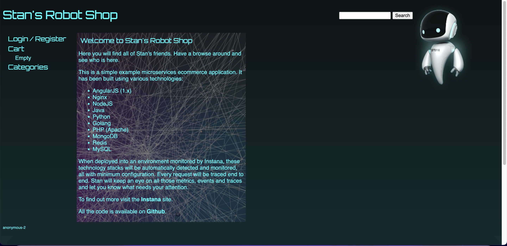

# Steps taken to launch application
```shell
docker-compose pull
docker-compose up
```

# Image of homepage


# Why is it wrong to commit directly 
Committing directly to the master branch allows people to push features to production without getting them code reviewed, this is especially bad if the feature causes breaking changes where if you are a business will affect customers. 

# How do we prevent this
settings -> branch -> branch protection and enable “require pull request before merging” 

# Changing logo and adding siganture 
Updated index.html by replacing the stan icons and replacing the footer with
out custom signature.

Next we built the image locally by running 

```shell
docker compose pull
docker compose build web 
```
After building a new web image we use it to replace the original.

```shell
Lastly we can run it with 
```

docker compose up

